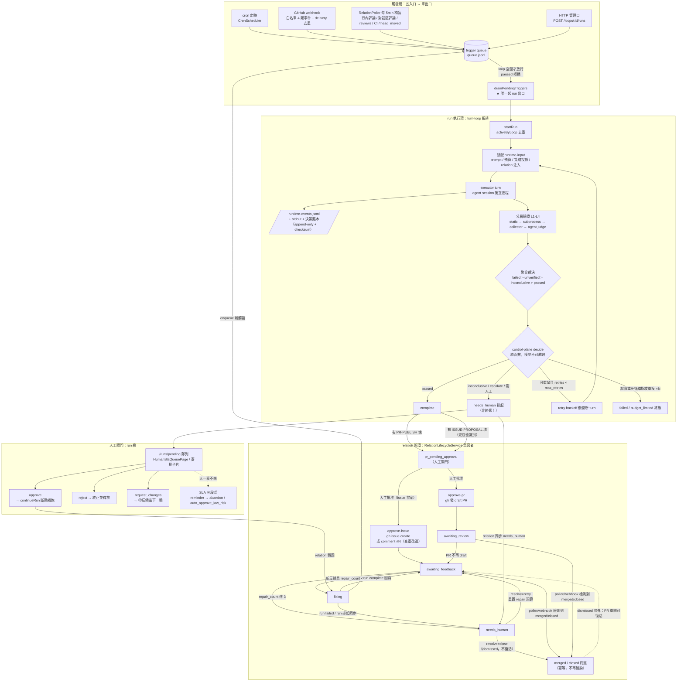

# Loop 閉環全流程圖（含邊界條件）

> 2026-08-15，對應代碼版本：閉環中心化（`87527a7`）+ relation 人工出口
> （`ff979e4`）+ ISSUE-PROPOSAL 閘門（`4a4303d`、`0b1cf57`）之後。
> 單寫者紀律：run 狀態機 = ControlPlane；relation 狀態機 = RelationLifecycleService；
> 起 run 唯一出口 = trigger-dispatcher。

## 邊界條件速查（全部確定性，無一依賴模型自覺）

| 層 | 邊界 | 行為 |
|---|---|---|
| 觸發 | loop 已有活躍 run / paused | 觸發留在隊列或被拒，不並發 |
| turn | `max_turns` / `max_time_minutes` / `max_retries` | 先到先停 → budget_limited 或 failed |
| turn | token 預算硬頂 | 超頂即 budget_limited，不可逾越 |
| 執行 | blocker fingerprint 重複 N 次 | 強制 failed（死循環熔斷） |
| 執行 | turn 空轉 10min（idle watchdog） | 標記 stagnation，升級人工 |
| 驗證 | 任一層 failed | 整體 failed（fail-closed） |
| 驗證 | judge 輸出非法 JSON | Zod 閘門攔截 → 重試一次 → inconclusive |
| 驗證 | inconclusive | 無自動路徑，只能 needs_human |
| 人工 | needs_human 掛起 | run 停在原地；relation 同步 needs_human（不假活） |
| 人工 | SLA 超時 | reminder → 按策略 abandoned / auto_approve_low_risk |
| relation | `repair_count ≥ 3` | 停止自動修復，轉 needs_human 等 resolve |
| relation | 終態（merged/closed） | poller 冪等跳過，不重複記日誌 |
| relation | 人工 dismissed | 即使 PR 重開也不復活（與 GitHub 側 close 區分） |
| 發布 | PR / issue / comment | 一律人工閘門批准後 server 執行，agent 無直達通道 |
| 提案 | publish_mode 漏配 | PR 塊、issue 塊都嘗試解析，提案不丟 |
| 恢復 | server 重啟 | 在飛 run 轉 needs_human 確認後斷點續跑 |
